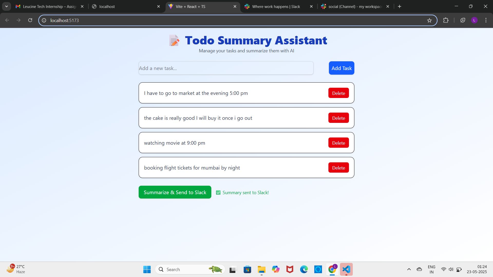
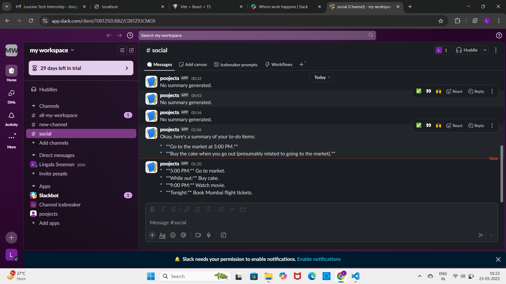

# Todo Summary Assistant

Manage todos, summarize with Google Gemini AI, and send summaries to Slack.

## Setup

1. Clone:
```bash
git https://github.com/Sreeman45/leucine_tech.git
cd leucine_tech
backend:
      cd backend && npm install
frontend:
      cd ../frontend && npm install

add your api key:
   GEMINI_API_KEY=your_gemini_api_key
   SLACK_WEBHOOK_URL=https://hooks.slack.com/services/your/webhook

cd .. (or) come to the root of the project and 'npm run dev'
open http://localhost:5173/ it would be live here



 